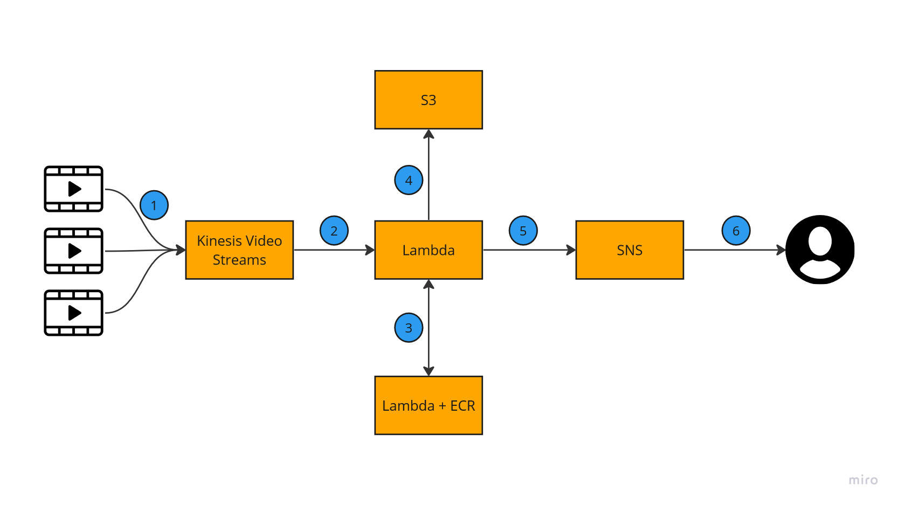
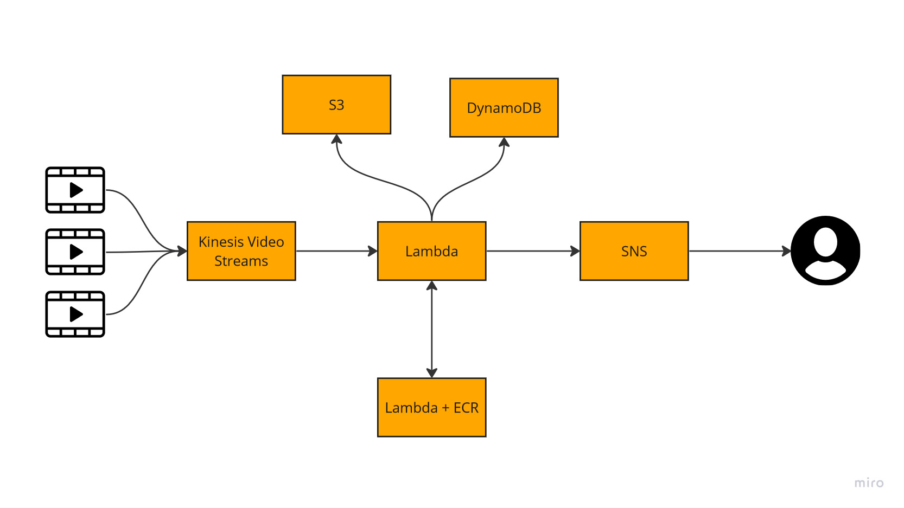
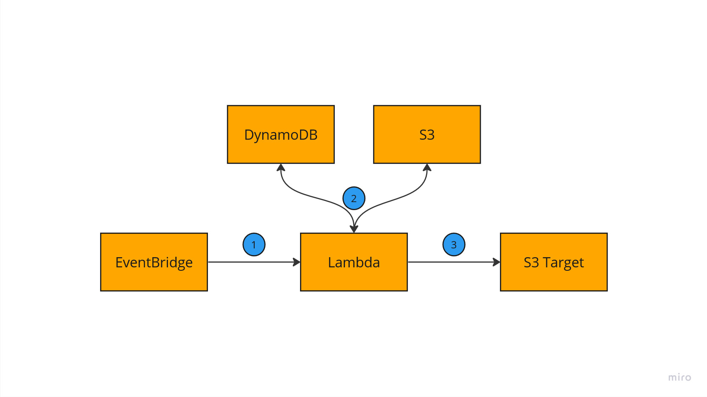

# Desafio MLOps Monuv

## Questão:
Visando uma melhor experiência para os clientes, que abordagens podem ser usadas para que o volume de falsos positivos recorrentes seja reduzido, de forma a solucionar o problema a curto, médio e longo prazo?
Enunciado completo em [Enunciado](<./Desafio - MLOps.pdf>).

## Arquitetura Básica
Começo apresentando uma arquitetura básica que pensei pro fluxo de processamento. A partir desse desenho, vou propor as soluções e modificações necessárias.

1. Os vídeos de 1 minuto são recebidos para processamento pelo Kinesis Video Streams.
2. Cada vídeo tem um _trigger_ para uma Lambda que é responsável por chamar a lambda de inferência, armazenar vídeos no S3 e acionar o tópico do SNS para notificações.
3. Estou assumindo que o modelo treinado está em um container. Esse container é registrado no ECR e é a imagem base para a Lambda de inferência. 
4. Os vídeos processados são armazenados no S3.
5. Em casos de detecção positiva, a lambda aciona o tópico SNS.
6. O SNS dispara as notificações para o meio acordado.

## Solução no curto prazo:
Assumindo que a confiança na detecção de pessoas é sempre bem alta, uma solução imediata seria aumentar o _threshold_ de confiança o máximo possível para que apenas as detecções com confiança bem alta sejam consideradas.

### Trade-off:

Se a confiança na detecção de pessoas tiver valores semelhantes aos dos casos indesejados, essa abordagem deixará de detectar pessoas, o que pode ser um problema ainda maior no ponto de vista de negócio.

## Solução no médio prazo:

Em Machine Learning, há geralmente duas abordagens para resolver um problema de um modelo:
* Model-Centric: o dataset é fixo e os foco das experimentações / soluções está em desenvolver modelos que performam melhor.
* Data-Centric: a qualidade dos dados é vista como crucial, logo as iterações são feitas em cima dos dados e não dos modelos.

Para esse problema, como o modelo já tem um mAP de 98% e tratam-se de dados não estruturados (vídeos / frames), a abordagem que deve ter mais resultado é a centrada em dados.

Além do mais, para o modelo estar confundindo outras formas com o ser humano, provavelmente é porque o conjunto de dados usado para treiná-lo não continha muitos vídeos sem seres humanos.

Dessa forma, a solução no médio prazo envolve retreinar o modelo com um conjunto de dados novo. Esse conjunto deve ter um balanço entre vídeos de câmeras sem seres humanos, preferencialmente incluindo os falsos positivos que já foram descobertos, e vídeos de câmera com seres humanos.

### Possíveis dificuldades e como resolvê-las:
**Recuperar os vídeos que deram falso positivo:**

Se, de acordo com a [arquitetura básica](./README.md#arquitetura-básica), todos os vídeos recebidos são armazenados no S3, precisamos de duas coisas para que a recuperação dos vídeos de falso positivo seja fácil e simples:
    
1. Organização e estruturação clara dos arquivos nos buckets do S3. O caminho sugerido é o de nomear cada vídeo debaixo de um ID único.

2. Armazenamento de metadados. Para isso vou apresentar duas possibilidades:

    * Ideal: DynamoDB, onde cada entrada na tabela é associada ao ID único do vídeo. Vantagens:

        * Escalabilidade automática:
        O DynamoDB oferece escalabilidade automática, ajustando a capacidade conforme necessário, sem a necessidade de intervenção manual.

        * Gerenciamento simplificado:
        Não há necessidade de se preocupar com a administração de um banco de dados, como dimensionamento, particionamento ou backup, pois o DynamoDB gerencia isso automaticamente.

        * Modelo de dados flexível:
        O DynamoDB suporta um modelo de dados flexível, permitindo que você adicione ou remova atributos de itens sem a necessidade de alterar o esquema da tabela.

        * Baixa latência:
        A latência de acesso a registros individuais no DynamoDB é geralmente mais baixa do que em um banco de dados relacional, sendo adequado para recuperação rápida de metadados específicos.

    * Econômica: RDS, onde há um esquema para associar os IDs únicos aos metadados. A vantagem, nesse caso, é o custo comparativo mais baixo. Porém, lidar com uma instância RDS requeriria retrabalho em caso de mudança dos metadados. Não obstante, seria necessário acompanhar a capacidade da instância, o que gera custo para a companhia no sentido homem / hora. Assim, sugiro o DynamoDB pois é mais apropriado para seguirmos em frente.

Segue novo desenho arquitetural com o DynamoDB:

**Haver poucos vídeos sem pessoas:**

Para isso a melhor alternativa seria usar de Data Augmentation em cima das imagens sem pessoas com técnicas como rotação, espelhamento, zoom, variação de brilho, adição de ruído e etc. O único ponto de atenção ao empregar essa técnica é que todas as imagens geradas sejam realistas a ponto de um ser humano conseguir identificá-las e analisá-las.

## Solução no longo prazo:

A solução no longo prazo é dar continuidade no que foi feito em médio prazo, automatizando processos, incluindo maior nível de monitoramento e de análises. Além de incluir possíveis abordagens centradas em modelos.

### Monitoramento de eventos

Para monitorar os eventos do fluxo pode-se utilizar o Cloudwatch para construir os dashboards, gerar métricas e alarmes. Dessa forma, é possível acompanhar a quantidade de vídeos chegando, o número de invocações e duração de cada execução de Lambda, assim como a quantidade de alertas enviados pelo SNS e outros casos.

A definição das métricas e thresholds de alarmes é um processo iterativo e contínuo de aprimoramento.

Além disso, é importante definir logs estruturados para as Lambdas, para ficar mais fácil em futuras análises.

### Monitoramento do modelo

Para monitoramento do modelo em produção é preciso avaliar se há data drift e constantemente fazer análise de erros. O Sagemaker Model Monitor pode ser utilizado diretamente para isso.

Ademais, uma abordagem interessante é periodicamente extrair uma amostra de vídeos que ficaram perto do threshold de confiança para avaliar os casos em que o modelo tem mais dúvida.

Um pipeline simples que pode fazer isso:

1. O EventBrigde é programado para periodicamente invocar a Lambda.
2. A Lambda extrai os vídeos que estiverem dentro do critério pelos metadados do DynamoDB e copia esses vídeos do S3 com todos os vídeos.
3. Esses vídeos são colados no bucket de destino (Target) juntamente com os metadados do processamento do vídeo, como confiança e classificação, em arquivo JSON ou CSV.

Assim, periodicamente, o engenheiro pode avaliar os resultados e, em caso de erros, esses vídeos podem ser utilizados nos próximos treinamentos.

### Análise de Erros Avançada

Para uma análise de erros avançada, é importante entender qual o tipo de vídeo está gerando os maiores erros. Para isso, pode-se fazer uso de tags nos vídeos que categorizam aquele vídeo, além da label que diz se há pessoas ou não. Exemplo de tags:

Cachorro, inseto, carro, cone ou qualquer outro tipo de ruído que possa atrapalhar o modelo. 

Assim, nas análises do modelo, podemos facilmente identificar que tipos de vídeo o modelo tem mais dificuldade e que podem ser o foco de iterações seguintes.

A dificuldade maior dessa abordagem está na anotação de tais categorias. Há dois caminhos possíveis:
1. Anotações manuais, com ferramentas open source como CVAT, por exemplo, que fornece customização das tags,
2. Anotações automáticas utilizando modelos como Amazon Rekognition, que tem um custo fixo e as tags usadas seriam os rótulos detectados.

### Treinamento

Com relação ao treinamento do modelo, recomendo utilizar o MLFlow em conjunto com o SageMaker.

* MLflow:
    * definir experimentos, 
    * fazer varredura de hiperparâmetros,
    * controlar versões de código, 
    * registrar parâmetros de treinamento, métricas, artefatos, modelos e metadados.

* SageMaker:
    * configurar instâncias de treinamento, 
    * integração com o S3,
    * gerenciar recursos de treinamento distribuído,
    * possibilidade de usar entrypoint para inferência em produção.
    
O MLflow simplifica o controle e a reprodução de experimentos enquanto que o SageMaker oferece escalabilidade e eficiência em termos de infraestrutura de treinamento.

Nessa abordagem de longo prazo, é relevante manter-se atualizado com novos modelos e atualizações constantes. Nesse caso, iterações [Model-Centric](#solução-no-médio-prazo) são bem-vindas.

## Conclusão

Diante do desafio de reduzir os falsos positivos recorrentes em nosso sistema de detecção de pessoas por imagem, apresentamos uma estratégia completa que contempla soluções imediatas, abordagens de médio prazo e um plano de longo prazo para aprimorar continuamente nosso modelo.

No curto prazo, sugerimos ajustar o _threshold_ de confiança, considerando os trade-offs para evitar a perda de detecções legítimas. No médio prazo, nossa estratégia concentra-se na abordagem centrada em dados, envolvendo a expansão do conjunto de treinamento com vídeos que representem casos de falsos positivos recorrentes. Essa abordagem busca atenuar as limitações do modelo atual, estabelecendo uma base mais sólida para futuras iterações.

Possíveis desafios envolvem recuperar vídeos de falsos positivos, e para superar isso, propomos uma organização eficiente no Amazon S3 e a implementação de um banco de dados NoSQL, como o DynamoDB, para armazenar metadados essenciais. A utilização de Data Augmentation e a anotação manual ou automática desempenharão papéis cruciais nesse processo.

No longo prazo, planejamos estabelecer um robusto sistema de monitoramento, utilizando o CloudWatch para eventos e métricas, e/ou utilizando o Sagemaker Model Monitor para avaliar o desempenho do modelo em produção. Propomos também um pipeline de análise de erros avançada, incorporando técnicas de identificação de categorias de vídeo que desafiam o modelo.

O treinamento contínuo do modelo será facilitado pela integração do MLflow e SageMaker, garantindo o controle e a reproducibilidade dos experimentos. Toda infraestrutura proposta é escalável e sob demanda e o custo deve ser acompanhada pelo centro de custos da AWS.

Em resumo, nossa estratégia visa não apenas corrigir as deficiências imediatas, mas também criar um ciclo de aprendizado contínuo que se adapte às complexidades dos dados em tempo real. Essa abordagem reforçará nossa capacidade de fornecer uma experiência de detecção de pessoas por imagem mais precisa e confiável aos nossos clientes ao longo do tempo.